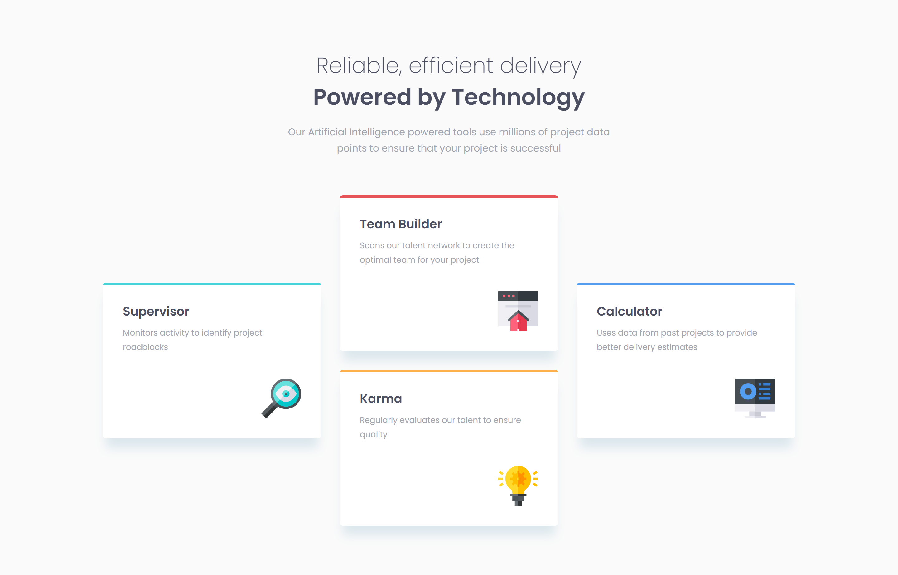

# Frontend Mentor - Four card feature section solution

This is a solution to the [Four card feature section challenge on Frontend Mentor](https://www.frontendmentor.io/challenges/four-card-feature-section-weK1eFYK). Frontend Mentor challenges help you improve your coding skills by building realistic projects.

## Table of contents

- [Overview](#overview)
  - [The challenge](#the-challenge)
  - [Screenshot](#screenshot)
  - [Links](#links)
- [My process](#my-process)
  - [Built with](#built-with)
  - [What I learned](#what-i-learned)
  - [Continued development](#continued-development)
  - [Useful resources](#useful-resources)
- [Author](#author)
- [Acknowledgments](#acknowledgments)

## Overview

### The challenge

Users should be able to:

- View the optimal layout for the site depending on their device's screen size

### Screenshot



### Links

- Solution URL: [My solution Url](https://your-solution-url.com)
- Live Site URL: [Four card section](https://jomagene.github.io/four-card-feature-section/)

## My process

### Built with

- Semantic HTML5 markup
- CSS custom properties
- Flexbox
- CSS Grid
- Mobile-first workflow
- Sass/SCSS

### What I learned

I have learned to use Sass mixins and variables to streamline my CSS and create reusable styles. I also explored how to integrate CSS Grid and Flexbox within media queries to create responsive layouts that adapt smoothly to different screen sizes.

To see how you can add code snippets, see below:

```scss
@mixin set-grid-area($row-start, $column-start) {
  grid-area: #{$row-start}/#{$column-start}/ span 2;
}

@media (min-width: 42.5rem) {
  .articles-section {
    grid-template: repeat(4, 1fr) / repeat(3, 1fr);
    .builder {
      @include set-grid-area(1, 2);
    }
    .karma {
      @include set-grid-area(3, 2);
    }
    .supervisor {
      @include set-grid-area(2, 1);
    }
    .calculator {
      @include set-grid-area(2, 3);
    }
  }
}
```

### Continued development

In future projects, I want to continue exploring advanced CSS techniques such as more complex grid layouts and improving my understanding of responsive design. Additionally, I plan to delve deeper into Sass optimizing performance in CSS and experimenting with newer CSS features.

### Useful resources

- [Sass Documentation](https://sass-lang.com/documentation/) - This helped me understand and effectively use Sass mixins and variables.
- [CSS Grid Garden](https://cssgridgarden.com/) - An interactive tool that helped me grasp CSS Grid concepts better.

## Author

- Frontend Mentor - [@Jomagene](https://www.frontendmentor.io/profile/Jomagene)
- Twitter - [@Jomagene](https://www.twitter.com/Jomagene)

## Acknowledgments

Thank you to the Frontend Mentor community for the inspiration and feedback on this project. Special thanks to anyone who provided guidance (Kevin Powel for example) and support during the development of this solution.
